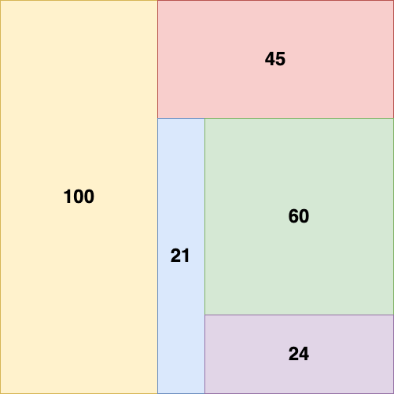

## Assignment

### Základní část

- webová stránka dostane v URL pole čísel [0, 100]
- cílem je vykreslit ve čtverec, který je kompletně vyplněn obdélníky
- každý obdélník odpovídá jednomu číslu ze vstupu (v URL)
- plocha obdélníku odpovídá číslu, který obdélník reprezentuje
  - tedy například pokud je 2x větší číslo, obdélník má být také 2x větší
- obdélníky se vykreslují v pořadí jak jsou ve vstupu a začíná se z levého horního rohu a střídá se vykreslení na výšku a na šířku, tedy například vstup 100,45,21,60,24 se vykreslí jako:



- pokud je vstup nevalidní, tak se zobrazí chybová stránka
- aplikace musí být napsaná v aktuální verzi Reactu

### Interaktivní rozšíření

- pokud uživatel klikne levou myší na nějaký obdélník, tak se ten obdélník rozdělí na 2 menší:
  - 1/3 původního čísla zaokrouhlená na celé číslo dolů a zbytek
  - vstup v URL se musí změnit, aby odpovídal aktuálnímu stavu
- je třeba zachovat správné pořadí na vstupu
- poznámka: po rozdělení obdélníku se mohou přeuspořádat ostatní obdélníky. Po refreshi stránky by se obrazec neměl změnit.

### Pokročilé rozšíření

- pokud kliknu na nějaký obdélník pravou myší, tak se obdélník vrátí do stavu před jeho posledním rozdělením
- vstup v URL se opět musí upravit, aby odpovídal aktuálnímu stavu
- příklad:
  - uživatel klikne levým tlačítkem na obdélník 46, ten se rozdělí na 15 a 31
  - uživatel klikne levým tlačítkem na obdélník 15, ten se rozdělí na 5 a 10
  - uživatel klikne levým tlačítkem na obdélník 10, ten se rozdělí na 3 a 7
  - uživatel klikne pravým tlačítkem na obdélník 5. Ten vznikl z obdélníku 15, tedy je potřeba sloučit 5, 3 a 7 zpět do 15.
  - výsledný stav jsou tedy obdélníky 15 a 31.

## Installation

```bash
$ yarn
```

## Running the app

```bash
# dev mode
$ yarn dev

# build
$ yarn build

# production mode
$ yarn preview
```
